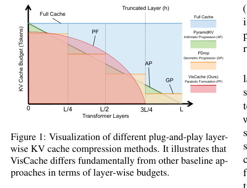
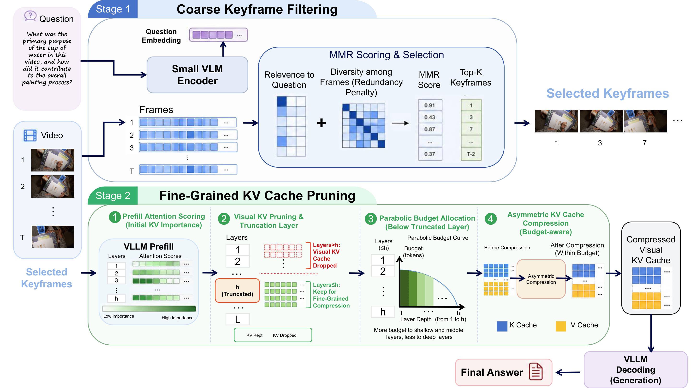
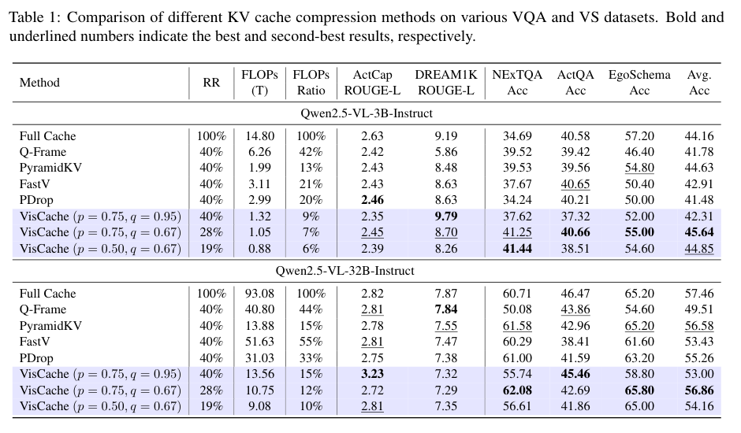
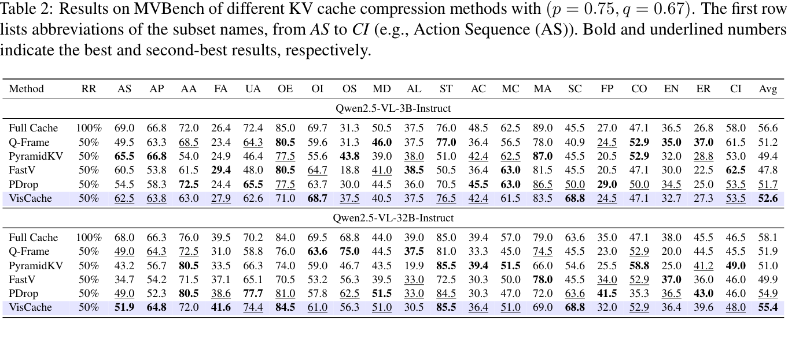

# VisCache — Visual KV Cache Pruning for Efficient Vision Large Language Model Inference

[](https://2026.emnlp.org/)

**Accepted as a Main Conference paper at EMNLP 2026.**

VisCache is a training-free, plug-and-play framework for coarse-to-fine **Visual KV Cache** pruning in video large language models (e.g. Qwen2.5-VL). It reduces visual-KV redundancy through two synergistic stages.

**Stage 1 — Prompt-aware temporal filtering.** A lightweight vision-language "scout" (CLIP) selects a compact, query-relevant, and diverse subset of keyframes via the Maximal Marginal Relevance (MMR) principle, eliminating temporal redundancy before inference.

**Stage 2 — PruneKV (layer-aware KV compression).** Rather than pruning uniformly, PruneKV allocates per-layer compression budgets following a parabolic decay: more visual tokens are kept in early layers that encode fine-grained details and progressively fewer in deeper layers, with visual KV entries beyond a truncation threshold fully evicted. It further adopts an asymmetric update that treats keys and values differently — unimportant keys are pruned while their values are fused into the retained tokens via similarity-weighted aggregation, preserving contextual information without growing the cache.

## Abstract

While Vision Large Language Models (VLLMs) have achieved remarkable success in multimodal reasoning, their long-context inference remains prohibitively expensive due to the massive computation and memory overhead of visual Key-Value (KV) caches. Existing KV compression methods often apply uniform pruning across visual tokens and layers, leading to substantial information loss and degraded performance. To address this challenge, we propose **VisCache**, a plug-and-play framework for coarse-to-fine **Vis**ual KV **Cache** pruning without training, which consists of two synergistic stages. First, a lightweight VLM filters temporal redundancy by selectively forwarding semantically informative keyframes. Second, we introduce PruneKV, a surgical KV compression algorithm tailored to the attention dynamics of VLLMs. Unlike rigid pruning strategies, PruneKV adopts a parabolic layer-wise budget allocation together with an asymmetric update mechanism that selectively prunes keys while fusing values, thereby preserving critical contextual information. Extensive experiments demonstrate that VisCache substantially improves inference efficiency, achieving up to 2.35× speedup and significant memory reduction while maintaining competitive performance with only 19–28% KV cache retention. VisCache consistently outperforms existing baselines, establishing a new Pareto frontier between efficiency and performance for long-context VLLM inference. Code is available in [https://github.com/Wlklk/VisCache](https://github.com/Wlklk/VisCache).

## Installation

```bash
git clone https://github.com/Wlklk/VisCache.git
cd VisCache
pip install -r requirements.txt
```

> **Requirements:** Python ≥ 3.9, PyTorch ≥ 2.0, and a CUDA-capable GPU (recommended for video-LLM inference). Model checkpoints (e.g. `Qwen/Qwen2.5-VL-3B-Instruct`) are downloaded automatically from the Hugging Face Hub on first run.

## Quick start

```bash
python run_demo.py
```

This loads `Qwen2.5-VL-3B-Instruct` + CLIP, runs the full VisCache pipeline on a random dummy video, and prints the generated answer.

## Method

Given a video and a prompt, the pipeline runs in four steps:

1. **Keyframe selection** (`keyframe.py`)
   CLIP encodes every frame and the text prompt. Frames are scored by MMR
   (relevance to text − diversity against already-selected frames) and the top
   `alpha · T` frames are kept, shrinking the video before it ever reaches the LLM.

2. **Prefill with attention accumulation** (`pipeline.py`)
   A forward hook on every decoder-layer `self_attn` (auto-located for Qwen-VL /
   LLaVA / InternVL / MiniCPM-V) sums the mean attention maps across all layers into
   one per-token importance score.

3. **Global visual-token selection** (`compression.select_visual_tokens`)
   Visual tokens are auto-located by their placeholder ids (e.g. `<|image_pad|>`),
   independent of how many system/text tokens precede them. The top `beta · V` visual
   tokens by accumulated attention are kept; all non-visual tokens are preserved.

4. **Layerwise progressive prune + fusion** (`compression.prune_kv_layerwise`)
   A monotonic parabola assigns each of the first `layer_id1` layers a decreasing
   keep-count; within each layer the top-scoring surviving tokens are kept and the
   dropped ones are fused into them (`selective_attention_fusion`). Layers
   `>= layer_id1` discard all visual tokens entirely ("small").

The compressed `past_key_values` is then fed straight into `model.generate`.

## Multi-model support

The pipeline is model-agnostic — nothing is hard-coded to Qwen2.5-VL:

- **Transformer layers** are auto-located by trying `language_model.layers`
  (Qwen-VL / InternVL), `model.layers` (LLaVA), `model.model.layers`, then
  `llm.layers` (MiniCPM-V). Override via `find_transformer_layers`.
- **Number of layers** is read from `model.config.num_hidden_layers` when
  `num_layers=None`; `layer_id1` then defaults to `round(0.75 · num_layers)`.
- **Visual tokens** are found by their placeholder ids. When `vision_token_ids`
  is `None`, common image placeholders are auto-detected
  (`<|image_pad|>`, `<image>`, `<|IMAGE_TOKEN|>`, ``, …). Pass an explicit
  set (e.g. `{model.config.image_token_index}`) for unusual tokenizers.
- **Input building** differs per architecture, so `run()` accepts a `build_inputs`
  callback. The default handles Qwen2.5-VL; LLaVA / others supply their own.

## Project layout

```
VisCache/                   # repository root
├── smallandbig/             # the package
│   ├── config.py        # SmallAndBigConfig: all hyperparameters
│   ├── keyframe.py      # CLIP + MMR keyframe selection
│   ├── compression.py   # global token selection, layerwise prune, fusion
│   ├── pipeline.py      # prefill hooks + compress + generate
│   └── __init__.py
├── benchmarks/              # evaluation harnesses
│   ├── loader.py       # MVBench task registry, sample loading, MCQ / ROUGE scoring
│   └── mvbench.py       # MVBench multiple-choice eval (reuses the package above)
├── efficiency/              # efficiency measurement
│   └── measure.py       # latency (CUDA events), KV-cache memory, theoretical FLOPs
├── run_demo.py          # minimal end-to-end usage example
├── requirements.txt
└── README.md
```

## Hyperparameters (`SmallAndBigConfig`)

| Param               | Default | Meaning                                                  |
|---------------------|---------|----------------------------------------------------------|
| `alpha`             | 0.5     | fraction of frames kept by keyframe selection            |
| `mmr_lambda`        | 0.7     | MMR trade-off: relevance vs. diversity                   |
| `beta`              | 0.67    | fraction of visual tokens kept after global selection    |
| `num_layers`        | auto    | total model layers; None -> read from model.config.num_hidden_layers |
| `layer_id1`         | auto    | layers 0..layer_id1-1 keep tokens; None -> round(0.75·num_layers): 27 (3B) / 48 (32B) |
| `compression_ratio` | 0.75    | target keep-ratio used by the parabolic allocation      |
| `alloc_steepness`   | 0.5     | how fast the per-layer keep-count decreases             |
| `min_tokens`        | 1       | lower bound on kept tokens per layer                     |
| `fusion_ratio`      | 0.3     | fraction of dropped tokens fused into each survivor      |
| `fusion_alpha`      | 0.2     | fusion strength                                          |
| `fusion_temperature`| 1.0     | softmax temperature over dropped-token attention        |
| `vision_token_ids`  | auto    | token ids marking visual tokens; None -> auto-detect common placeholders |

## Usage

```python
from smallandbig import SmallAndBigConfig, run

config = SmallAndBigConfig()   # num_layers / layer_id1 auto-derived from the model

answer = run(
    model=model,                # Qwen2.5-VL
    processor=processor,
    messages=messages,          # chat template with the video + prompt
    video_tensor=video_tensor,  # raw frames [T, 3, H, W]
    clip_model=clip_model,      # CLIP for keyframe selection
    device=device,
    config=config,
    max_new_tokens=128,
)
```

For non-Qwen processors, pass a `build_inputs` callback that returns the model
inputs (the clip-based keyframe selection still runs upstream):

```python
def llava_build_inputs(processor, messages, video_tensor, device):
    prompt = next(c["text"] for c in messages[0]["content"] if c["type"] == "text")
    inputs = processor(images=video_tensor, text=prompt, return_tensors="pt")
    return inputs.to(device)

run(..., build_inputs=llava_build_inputs)   # vision_token_ids auto-detected
```

See `run_demo.py` for a complete example.

## Benchmarks — MVBench

`benchmarks/mvbench.py` evaluates VisCache on the 20 MVBench sub-tasks. It reuses
the package end-to-end: CLIP keyframe selection → prefill with attention
accumulation → `compress_kv_cache` → `model.generate`, then scores each sample as
multiple-choice with `mcq_acc`. The 20 tasks are described by a single declarative
registry (`MVBENCH_TASKS` in `loader.py`) instead of 20 duplicated branches.

```bash
python -m benchmarks.mvbench \
    --model_path Qwen/Qwen2.5-VL-3B-Instruct \
    --mvbench_root /data/MVBench --json_root /data/MVBench/JSON \
    --clip_model ViT-B/32 --tasks AS AP AC
```

Per-task and overall accuracy are written to `mvbench_results_ours_<model>.txt`.
Other video benchmarks (EgoSchema, ActCap, DREAM1K, ActQA, NextQA, …) follow the
same `BenchmarkSample` contract and can reuse the scoring helpers in `loader.py`.

## Datasets (Hugging Face)

All benchmarks evaluated in the paper are publicly hosted on the Hugging Face
Hub. VisCache reuses the standard `lmms-eval` / original dataset loaders — you
only need to point the data paths (e.g. `--mvbench_root`) at a local copy of
the downloaded files.

| Benchmark                | Task type                       | Hugging Face dataset                                                                                       |
|--------------------------|---------------------------------|-----------------------------------------------------------------------------------------------------------|
| MVBench                  | Multiple-choice video QA (20 tasks) | [OpenGVLab/MVBench](https://huggingface.co/datasets/OpenGVLab/MVBench)                                   |
| EgoSchema                | Long-form egocentric MC QA      | [lmms-lab/egoschema](https://huggingface.co/datasets/lmms-lab/egoschema)                                 |
| DREAM-1K                 | Fine-grained video description  | [omni-research/DREAM-1K](https://huggingface.co/datasets/omni-research/DREAM-1K)                         |
| ActivityNet-QA (ActQA)   | Open-ended / MC video QA        | [lmms-lab/ActivityNetQA](https://huggingface.co/datasets/lmms-lab/ActivityNetQA)                         |
| NExT-QA (NextQA)         | Causal / temporal MC video QA   | [VLM2Vec/NExTQA](https://huggingface.co/datasets/VLM2Vec/NExTQA)                                         |
| ActivityNet Captions (ActCap) | Dense video captioning     | [HuggingFaceM4/ActivitiyNet_Captions](https://huggingface.co/datasets/HuggingFaceM4/ActivitiyNet_Captions) |

## Models (Hugging Face)

The experiments in this paper are conducted on the following vision-language
backbones. All weights are released on the Hugging Face Hub.

| Model (evaluated in the paper) | Hugging Face checkpoint |
|--------------------------------|-------------------------|
| Qwen2.5-VL-3B-Instruct         | [Qwen/Qwen2.5-VL-3B-Instruct](https://huggingface.co/Qwen/Qwen2.5-VL-3B-Instruct) |
| Qwen2.5-VL-32B-Instruct        | [Qwen/Qwen2.5-VL-32B-Instruct](https://huggingface.co/Qwen/Qwen2.5-VL-32B-Instruct) |
| Qwen3-VL-4B-Instruct           | [Qwen/Qwen3-VL-4B-Instruct](https://huggingface.co/Qwen/Qwen3-VL-4B-Instruct) |
| LLaVA-OneVision (Qwen2-7B-ov)  | [llava-hf/llava-onevision-qwen2-7b-ov-hf](https://huggingface.co/llava-hf/llava-onevision-qwen2-7b-ov-hf) |

The pipeline is model-agnostic and additionally supports InternVL and MiniCPM-V
(see *Multi-model support*); those are provided for compatibility and are
**not** part of the experiments reported in this paper, so no links are listed
here for them.

## Baselines

Table 1 and Table 2 compare VisCache against the following plug-and-play KV
cache / visual-token compression methods. The links point to their original
papers.

| Method | Paper | Venue |
|--------|-------|-------|
| **Q-Frame** (Zhang et al., 2025a) | [Q-Frame: Query-aware Frame Selection and Multi-Resolution Adaptation for Video-LLMs](https://arxiv.org/abs/2506.22139) | **ICCV 2025** |
| **PyramidKV** (Cai et al., 2024) | [PyramidKV: Dynamic KV Cache Compression based on Pyramidal Information Funneling](https://arxiv.org/abs/2406.02069) | **COLM 2025** |
| **FastV** (Chen et al., 2024a) | [An Image is Worth 1/2 Tokens After Layer 2: Plug-and-Play Inference Acceleration for Large Vision-Language Models](https://arxiv.org/abs/2403.06764) | **ECCV 2024** (Oral) |
| **PDrop** (Xing et al., 2024) | [PyramidDrop: Accelerating Your Large Vision-Language Models via Pyramid Visual Redundancy Reduction](https://arxiv.org/abs/2410.17247) | **CVPR 2025** |

## Efficiency measurement

`efficiency/measure.py` reports the three metrics used in the paper, all
model-agnostic:

```python
from efficiency import measure_generate, kv_cache_memory_mb, estimate_decode_flops, format_flops

gen = measure_generate(model, inputs, max_new_tokens=128)   # total / prefill / decode (ms)
mem = kv_cache_memory_mb(new_cache)                        # KV-cache footprint (MB)
flops = estimate_decode_flops(model, gen["generated_tokens"], gen["generated_tokens"])
print(gen["total_ms"], mem, format_flops(flops["total"]))
```

`estimate_decode_flops` is a closed-form count of the decode-stage FLOPs
(per-layer projections + MLP + quadratic attention that scales with the
compressed cache length); `measure_generate` / `measure_decode` are wall-clock
timings taken with CUDA events.

## Main results from the paper

Below are the key figures and tables from the EMNLP 2026 paper (see the PDF in
the repository for the complete results and appendices).

### Layer-wise budget visualization


*Figure 1: Visualization of different plug-and-play layer-wise KV cache compression
methods. VisCache differs from the baselines in the shape of the per-layer budget
allocation (parabolic decay with a hard truncation layer).*

### Framework overview


*Figure 2: Overview of VisCache. Stage 1 (top) uses a lightweight scout VLM to
filter redundant keyframes via MMR; Stage 2 (bottom) performs attention-aware,
layer-wise KV cache pruning with PruneKV.*

### Comparison with baselines on VQA and VS datasets



### MVBench results


